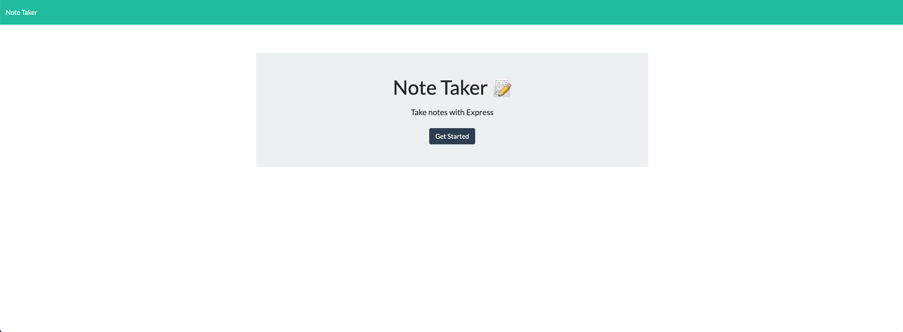
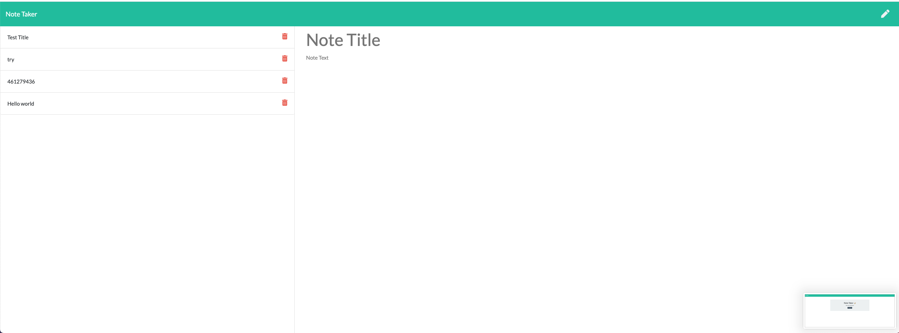

# Homework-11: Note Taker.

# Description

This was my homework #11 Note Taker. In this homework, the objective was to use a starter code called Note taker that can be used to write and save notes. This application will use an Express.js back end and will save the retrieve note data from a JSON file.

The starter code already contained a front end. My job was to build the back end, connect the two, and then deploy the entire application to Heroku.

First I started by installing "npm i" and create a server.js file along with route folder which contained apiRoutes.js & htmlRoutes.js file structures. in the file server.js, I wrote codes that would serve as a backbone to the application. After completing that I moved on to apiRoutes and htmlRoutes. htmlRoutes was the front end welcome screen when you opened the application and apiRoutes was to code the interactiveness between the user on which note they decide to write and save. Specifically with apiRoutes I declared "let notes = require(../db/db.json) --> This is an array and it will change upon user input each time. Originally, I declared this as a "const" and had issues with deployment, but later I changed to "let" variable and it made deployment much easier. Also on apiRoute code I also declared fs.writeFileSync also to help with deployment.

# Installation

Please go to this link on Heroku app to use the application.  
https://young-temple-18133.herokuapp.com/

# Usage

Please follow the directions from README file.

# Contributing

Please follow the directions from README file.

# Tests

Please follow the directions from README file.

# Questions

Need to contact [jung0808?](https://github.com/jung0808)  
[You can contact me here - Email](mailto:j.nam0808@gmail.com)

# Screenshot of Project

##   Attached is also a personal link to my homework assignment #11

## https://github.com/jung0808/homework-11-note-taker
